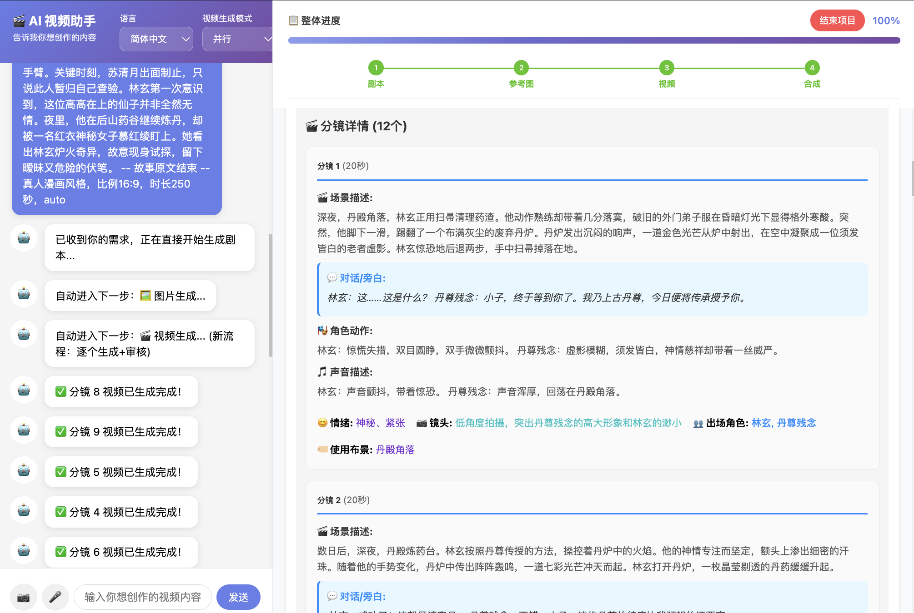
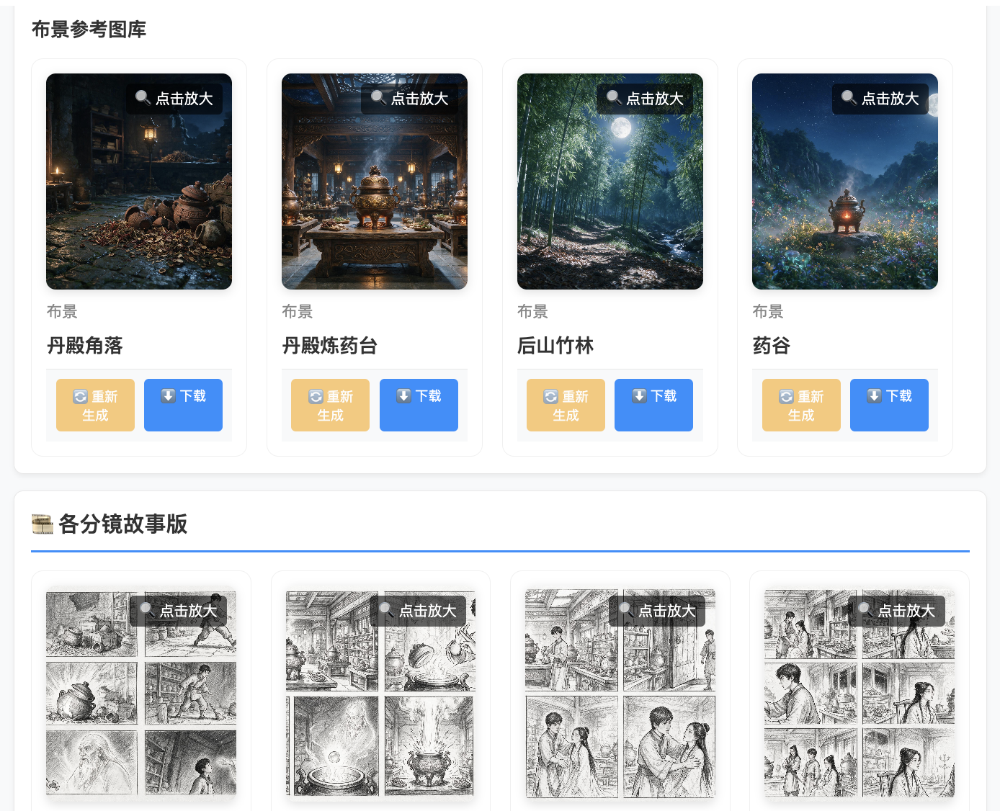
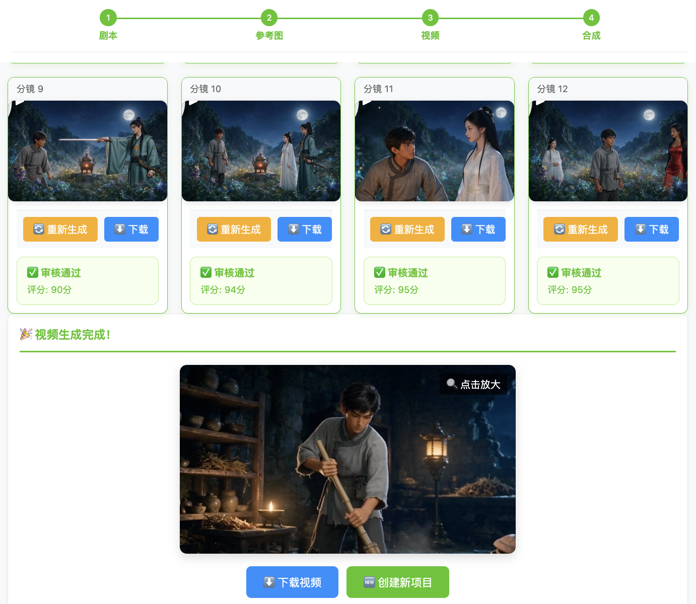
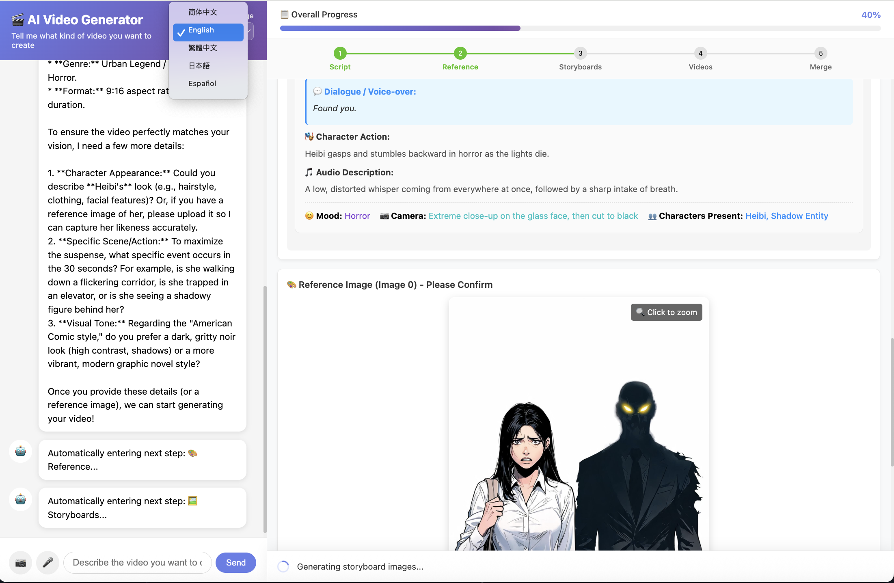

# Seedance Drama Maker · AI 短剧生成引擎

简体中文文档。English version: `README.en.md`

- 🌐 在线体验：<https://s0sij5su2u6qe1sds1et0.apigateway-ap-southeast-1.apigw-byteplus.com/>
- 当前版本：`2.0.0`
- 技术栈：`FastAPI`、`WebSocket`、多 Agent 协作、`FFmpeg`
- 产品能力：`TOS`、`Seed-Speech`、`Seed-2.1-turbo`、`SeeDream-5.0-pro`、`SeeDance-2.5`
- AI 开发工具：`Trae.ai`、`DeepSeek-V4-Flash-GA`、`GPT-5.5`

## ✨ Seedance 2.5 核心亮点

由 **SeeDance 2.5** 视频模型驱动，一句话即可产出电影级 AI 短剧：

- 🎬 **单镜头最长 30 秒**：单个分镜时长可达 30 秒（6–30 秒可调），长镜头叙事更连贯，最终成片总时长上限 `600` 秒。
- 🖼️ **最多 50 个参考输入**：单任务可融合最多 50 张人物 / 布景参考图，角色与场景跨镜头高度一致。
- 🌍 **14 种语言原生支持**：原生多语种对白与旁白生成，覆盖中、英、日、西等 14 种语言。
- 🎞️ **电影级视听效果**：原生音画同步、自适应画幅比例，成片统一转封装为高保真 `MP4`（H.264/AAC，`+faststart`），Web 端可直接边下边播。
- 🎭 **角色装扮 / 布景状态变体**：按分镜自动派生角色装扮图与布景时间/天气状态图，并在故事版、分镜视频中一致引用。
- 🧩 **白描故事版 + AI 审核**：先出白描多宫格故事版并自动审核（风格、角色不重复且肢体正常、性别正确），不合格自动重生成。
- 📄 **连环画 PDF 自动导出**：进入分镜视频阶段时并行生成按剧本标题命名的连环画 PDF，包含封面、角色页和逐分镜故事版，可从 Web UI 下载。
- 🤖 **多 Agent 全自动流水线**：剧本 → 参考图库 → 角色装扮/布景状态变体 → 分镜故事版 → 分镜视频生成与审核 → 长视频合成，一站式闭环。

## 项目简介

这是一个聚焦于 AI 长视频生成的多 Agent 系统，支持自动模式与手动模式两种工作方式。在保证生成质量的前提下，系统尽量简化人工操作，把用户从繁琐的脚本拆解、角色整理、布景统一、分镜衔接、质量复审和长视频合成中解放出来。

项目适用场景包括但不限于：

- 社交媒体数分钟广告视频生成
- 一句话生成短剧 / 漫剧
- 基于参考图片与语音输入生成连续叙事长视频
- 多个长视频任务并行运行，开箱即用

系统会自动协同生成剧本、角色设定、布景设定、对白、音效约束与分镜视频，并结合 AI 质量审核、自动/手动重生成、相邻分镜平滑过渡控制，完成从一句话需求到最终长视频成片的完整链路。

当前主流程为：

```text
需求输入 -> 剧本生成 -> 参考图库确认 -> 角色装扮/布景状态变体 -> 分镜故事版生成与审核 -> 连环画 PDF 导出 + 分镜视频生成与审核 -> 最终合成
```

系统重点解决以下问题：

- 剧本、角色设定、布景设定、分镜脚本的统一生成
- 多参考图协同生成，支持人物/角色与布景分流
- 自动模式与手动模式下的一致流程控制
- 视频审核失败后的自动重试与人工接管
- 多语言前端与多浏览器标签页独立任务隔离
- 云端交互式请求隔离：上传与录音转文字走独立线程池，避免被生图/生视频长阻塞任务挤占导致网关超时

## 项目展示

### 界面与生成流程

**UI 界面展示与生成剧本**：一句话需求输入后，系统自动生成标题、风格、角色设定、布景设定与分镜脚本。



**生成故事版参考图**：为每个分镜生成白描多宫格故事版，并经 `StoryboardReviewAgent` 自动审核（风格 / 角色不重复且肢体正常 / 性别正确）。



**分镜视频与合成**：逐个分镜生成视频、AI 审核并进行最终长视频合成。



**支持多语言**：前端界面支持 `zh-CN` / `zh-TW` / `en` / `ja` / `es`，视频对白原生支持 14 种语言。



### 视频演示

- 全自动 Agent 演示：[demo/how-to-use-cn.mp4](./demo/how-to-use-cn.mp4)
- 2 分钟真人剧：[demo/real-drama.mp4](./demo/real-drama.mp4)
- 2 分钟漫剧：[demo/comics-drama.mp4](./demo/comics-drama.mp4)

## 使用的 BytePlus 产品

- `TOS`
  用于上传、存储和分发用户上传素材、参考图、连环画 PDF、分镜视频和最终视频。
- `Seed-Speech`
  用于语音转文字，支持通过录音输入视频创作需求。
- `Seed-2.1-turbo`
  用于分镜视频审核，评估人物/角色一致性、物理规律和脚本语义一致性。
- `SeeDream-5.0-pro`
  用于人物/角色参考图与布景参考图生成和重生成。
- `SeeDance-2.5`
  用于分镜视频生成，支持单镜头 6–30 秒、最多 50 个参考输入、14 种语言原生对白与原生音画同步。

以上能力来自 [byteplus.com](https://www.byteplus.com/)。

## AI 开发工具

- `Trae.ai`：代码开发、排查、工程整理
- `DeepSeek-V4-Flash-GA`：需求梳理、方案讨论、文档辅助
- `GPT-5.5`：代码修改、逻辑整理、调试、文档重写

## 运行前提准备

### 环境要求

- Python `3.9+`
- 运行环境可执行 `ffmpeg` 与 `ffprobe`（本地、Docker、云端 veFaaS 镜像均需要安装）
- 运行环境需安装可覆盖 CJK 的字体和常见 emoji 字体，例如 `fonts-noto-cjk`、`fonts-noto-color-emoji` 与 `fontconfig`；否则云端生成连环画 PDF 时中文/日文/韩文或 emoji 可能显示为方框乱码
- 网络可访问 BytePlus / ModelArk / Seed-Speech / TOS

### 服务开通要求

在运行本程序前，需要先准备以下账号和能力：

- 开通 `ModelArk` 对应模型，并获取 `apikey`
- 开通 `Seed-Speech`，并获取 `appid` 与 `apikey`
- 开通 `TOS`，并获取 `AK/SK`
- 在 `TOS` 中建立你自己的公共可读存储桶 `bucket`
- 在 `config.yaml` 中配置这些服务的 `endpoint` 等非敏感项；真实的 `apikey` / `AK` / `SK` / `appid` / `bucket` 一律写入项目根目录的 `.env`

### 凭证治理规则

- 所有模型 `apikey`、对象存储 `AK/SK`、语音识别凭证、`endpoint` / `bucket` 等敏感信息，只允许在 `.env` 中设定。
- `config.yaml` 仅保留 `${VAR}` 占位符，运行时由 `app/config.py` 从 `.env` 注入，业务代码不得硬编码任何真实凭证。
- `.env` 已被 `.gitignore` 忽略，禁止提交到版本库；可复制 `.env.example` 作为模板填写真实值。
- 如果不同模型使用不同 `apikey`，也只能放在 `.env` 的对应变量中。

### 最小配置示例

敏感凭证写入项目根目录的 `.env`（可复制 `.env.example`）：

```bash
# BytePlus TOS 认证
BYTEPLUS_AK=your-byteplus-ak
BYTEPLUS_SK=your-byteplus-sk
TOS_REGION=ap-southeast-1
TOS_BUCKET=your-public-bucket
TOS_ENDPOINT=https://tos-ap-southeast-1.bytepluses.com

# ModelArk
MODELARK_API_KEY=your-modelark-api-key
MODELARK_BASE_URL=https://ark.ap-southeast.bytepluses.com/api/v3

# Seed-Speech ASR
SPEECH_APPID=your-seed-speech-appid
SPEECH_API_KEY=your-seed-speech-api-key

# 大模型 Endpoint / API Key
MAIN_AGENT_ENDPOINT=your-main-agent-endpoint
MAIN_AGENT_API_KEY=your-main-agent-api-key
SCRIPT_ENDPOINT=your-script-endpoint
SCRIPT_API_KEY=your-script-api-key
IMAGE_ENDPOINT=your-image-endpoint
IMAGE_API_KEY=your-image-api-key
VIDEO_ENDPOINT=your-video-endpoint
VIDEO_API_KEY=your-video-api-key
VIDEO_REVIEW_ENDPOINT=your-video-review-endpoint
VIDEO_REVIEW_API_KEY=your-video-review-api-key

# Virtual asset library
ASSET_LIBRARY_REGION=ap-southeast-1
ASSET_LIBRARY_API_HOST=ark.ap-southeast-1.byteplusapi.com
ASSET_LIBRARY_PROJECT_NAME=default
```

`config.yaml` 中对应字段保留占位符即可，运行时会自动从 `.env` 注入：

```yaml
byteplus:
  ak: "${BYTEPLUS_AK}"
  sk: "${BYTEPLUS_SK}"

modelark:
  api_key: "${MODELARK_API_KEY}"
  base_url: "${MODELARK_BASE_URL:-https://ark.ap-southeast.bytepluses.com/api/v3}"

server:
  port: 8888

models:
  main_agent:
    endpoint: "${MAIN_AGENT_ENDPOINT}"
    api_key: "${MAIN_AGENT_API_KEY}"
  # 其余模型段同理，均使用 ${VAR} 占位符
```

## 功能与流程介绍

### 1. 需求输入

支持以下输入方式：

- 文字描述
- 上传参考图片
- 录音输入并调用 `Seed-Speech` 转文字

录音转文字链路会保留浏览器实际录音格式：Chrome / 云端浏览器常见的 `webm/opus` 会以 `.webm` 上传，并在提交 `Seed-Speech` 时自动使用 `format=webm`、`codec=opus`；本地或其它环境生成的 `wav/mp3/m4a/ogg` 也会按扩展名自动适配。ASR 轮询属于阻塞式网络调用，服务端统一放入交互式线程池执行，避免与生图/生视频生成线程池互相阻塞。

### 2. 剧本生成

`ScriptAgent` 负责生成：

- 标题、风格、背景
- 角色设定
- 布景设定
- 分镜脚本

当前逻辑约束：

- 视频总时长上限：`600` 秒
- 单个分镜时长范围：`6`–`30` 秒（适配 `SeeDance-2.5`）
- 分镜数量上限：`50`
- 角色设定上限：`30`
- 布景设定上限：`30`
- 相邻分镜要求连贯承接，但不得重复复述
- 分镜中的特殊装扮与发型变化显式写入 `character_outfits`，布景时间/天气状态显式写入 `scene_state`；两者均位于“场景描述”之前，并持久化用于后续生图/生视频
- 大模型原始响应会输出到服务端日志

### 3. 参考图库生成

`ImageAgent` 会生成统一参考图库，分为：

- 人物/角色参考图库
- 布景参考图库

当前支持的上传规则：

- 前端一次最多上传 `30` 张参考图
- 其中人物/角色最多 `10` 张
- 布景最多 `20` 张
- 每张上传图片都需要命名

上传后的两种行为：

- 勾选“使用原图”
  不再对上传图和命名做大模型处理，直接按类型进入参考图库。
- 不勾选“使用原图”
  系统会基于上传图和剧本中的角色/布景设定生成统一参考图库。

只有在所有参考图生成或重生成任务都完成后，系统才会进入下一步倒计时或等待继续指令。

### 3.1 虚拟素材库（Private Virtual Portrait Library）

系统已经接入虚拟素材库能力：

- 每个项目创建独立素材资产组，维持项目与素材资产组一一对应
- 项目内所有人物/角色图片，包括上传原图与生成参考图，都会注册为素材资产并记录 `asset_id`
- 支持 NSFW 素材上传，创建素材时使用 `Moderation.Strategy = Skip` 关闭 Content pre-filter
- 只有当素材状态轮询到 `GetAsset.Status = Active` 后，才会进入视频生成链路

鉴权说明：

- 视频推理仍使用 `ModelArk Bearer API Key`
- 素材库接口使用 `BytePlus AK/SK` 签名调用
- 因此运行时必须同时配置 `MODELARK_API_KEY` 与 `BYTEPLUS_AK/BYTEPLUS_SK`
- 当前账号还需要在 BytePlus 控制台开通虚拟素材库对应订阅，否则 `CreateAssetGroup` 会返回 `SubscriptionRequired`

### 3.2 角色装扮图与布景状态图

在所有角色主图与场景主图生成完成后，系统会按各分镜内容自动派生变体图：

- 仅当分镜 `character_outfits` 包含与默认 `clothing` / `hairstyle` 不同的角色装扮，或 `scene_state` / `time_of_day` / `weather` 与布景默认状态不同时才生成
- 角色装扮图 = 该分镜的角色装扮描述 + 对应角色主图
- 布景状态图 = 该分镜的时间/天气状态 + 对应场景主图
- 多个分镜的装扮图/状态图并行生成，受图片生成并发数（`video_generation.reference_images.max_concurrency`）控制
- 变体图会做去重复用（相同“角色::装扮”或“场景::时间::天气”只生成一次），并在故事版、分镜视频中优先引用

### 3.3 分镜故事版生成与审核

`ImageAgent` 会为每个分镜生成白描多宫格故事版，`StoryboardReviewAgent` 使用多模态视觉模型审核 3 个硬性条件（任一不满足即自动重生成）：

1. 白描（黑白线稿）风格，且包含 `4`–`7` 幅宫格图（不要求固定 2 行 x 3 列排列）
2. 同一角色在同一分格不重复出现，且任一角色不出现多于 2 只手臂或多于 2 条腿
3. 角色性别与角色清单一致

故事版“重新生成”的逻辑、UI 展示与次数上限与分镜视频一致，受 `storyboard_review.max_retries`（默认 `2`，总生成次数 = 首次 + 重试）控制。

### 4. 分镜视频生成

`VideoAgent` 生成每个分镜视频时，会结合：

- 角色图（若该分镜有角色装扮图，则优先使用角色装扮图）
- 场景图（若该分镜有布景状态图，则优先使用布景状态图）
- 该分镜的白描 9 宫格故事版
- 当前分镜脚本与用户风格要求

其中人物/角色参考图会优先使用虚拟素材库的 `asset://asset-id` 形式写入视频生成请求，例如：

```json
{
  "type": "image_url",
  "role": "reference_image",
  "image_url": {
    "url": "asset://asset-xxxxxxxx"
  }
}
```

参考素材的引用逻辑按视频模式区分（可在前端切换）：

- **并行模式（默认）**：多个分镜同时生成，速度更快；各分镜只引用角色图 / 场景图 / 故事版，互不引用上一分镜视频
- **延长模式**：分镜串行生成，速度偏慢，但优化了分镜间的过渡——除分镜 1 外，其余分镜额外引用“上一分镜的生成视频”作为 `reference_video`，仅用于保持角色形象/服装/场景/光线一致，并从新机位推进本分镜的新剧情，避免相邻分镜画面雷同

关键规则：

- 自动失败重试次数受 YAML 配置限制（`video_review.max_retries`、`video_generation.scene_total_generate_limit`）
- 人工点击“重新生成”不计入自动失败预算
- 视频提示词默认追加“限定：不生成背景音乐”，除非用户需求中明确指定背景音乐风格

### 4.1 项目结束与资源清理

进入分镜视频生成阶段时，系统会同步启动连环画 PDF 生成任务：

- PDF 文件使用剧本标题命名并上传到 `TOS` 的 `documents/comics` 路径
- 第 1 页展示剧本标题、时代与背景；第 2 页展示主要角色名称和角色图
- 后续每页对应一个分镜，按顺序展示故事版图片，以及“场景描述”和“对话/旁白”
- Web UI 会在“各分镜故事版”和“分镜视频”之间展示 PDF 下载入口
- 项目结束清理会保留本项目的连环画 PDF，不会把它当作临时文件删除

Web UI 新增“结束项目”按钮，并支持在以下场景触发清理：

- 用户手动点击“结束项目”
- 用户主动关闭当前项目页面
- 用户关闭浏览器，前端通过 `sendBeacon` / `keepalive fetch` 做最佳努力上报

清理范围：

- 删除本项目在 `TOS` 中的临时文件与临时目录
- 删除本项目虚拟素材库中的素材资产
- 删除本项目对应的素材资产组

如果项目已经产出最终视频，则保留 `videos/final` 下的最终成片，避免误删导出结果。

### 5. 视频审核与流程推进

`VideoReviewAgent` 使用 `Seed-2.1-turbo` 做分镜视频审核。

审核维度：

- 人物/角色一致性
- 物理世界规律
- 与分镜脚本语义一致

当前默认审核配置：

- `video_review.pass_threshold = 60`
- `video_review.max_retries = 2`
- `video_review.default_mode = auto`

流程规则：

- 自动模式：审核失败后自动重试；达到上限后自动选择最高分结果继续流程
- 手动模式：审核仍会执行，但不自动重试；用户可以手动继续下一步
- 只要仍有自动或人工“重新生成”任务未完成，系统不会提前进入下一步 countdown
- 云端长任务通过稳定 `client_id` 路由到最新 WebSocket 连接；即使 API 网关或浏览器中途重连，后台生成完成和审核结果仍会推送到当前前端
- 并行模式下每个分镜完成后都会即时持久化项目状态，避免某个序号靠后的分镜遇到 504 后导致已完成结果丢失
- 自动模式达到重试上限后选择最高分视频继续时，会标记为“已接受（超过重试次数）”，不会阻塞后续合成

### 6. 合成

`MergeAgent` 与 `FFmpegService` 负责最终合成。

当前默认合成配置：

- `SeeDance-2.5` 生成任务与参考视频统一使用 `MOV`，`FFmpeg` 多段合成为 `MOV`
- 合成前对各分镜片段做参数归一化（统一 H.264/`yuv420p` + AAC `48kHz` 立体声 + CFR），避免不同片段音频采样率/编码不一致导致成片后半段无声或 Web 播放中断
- 合成后统一转封装为 `MP4`（优先 `-c copy` 无损转封装，失败回退 `H.264/AAC` 重编码），并启用 `-movflags +faststart` 前置 `moov atom`，Web 端可边下边播
- 最终上传并由前端播放的成片为 `MP4`
- `merge.temporary_edge_trim = off`
- `trim_previous_end_frames = 0`
- `trim_next_start_frames = 1`

视频与审核全部完成后：

- 自动模式：先显示倒计时，再自动进入合成
- 手动模式：先显示倒计时提示，随后等待聊天区继续指令进入合成

## 提示词示例

### 自动模式

`以女生heibi为主角，香港中环写字楼场景，生成美漫风格，都市怪谈悬疑恐怖故事。比例9:16，时长30秒。auto`

### 手动模式

`以大学校园为场景，Q版动漫风格，学生的励志故事。比例4:3，时长90秒`

### 支持上传素材

- 可上传 `参考图片`
- 可上传 `语音`
- 可混合上传人物/角色图和布景图

## 系统架构

```text
Browser UI
  |- static/index.html
  |- static/css/style.css
  |- static/js/app.js
  |- static/i18n/*.json

FastAPI App
  |- app/main.py
  |- REST API
  |- WebSocket manager

MainAgent
  |- ScriptAgent
  |- ImageAgent
  |- StoryboardReviewAgent
  |- VideoAgent
  |- VideoReviewAgent
  |- MergeAgent

Services
  |- LLMService
  |- ASRService
  |- TOSService
  |- FFmpegService
```

### 关键设计点

- 所有敏感凭证统一写入 `.env`，`config.yaml` 仅保留 `${VAR}` 占位符，运行时由 `app/config.py` 注入
- 前后端界面支持 `zh-CN`、`zh-TW`、`en`、`ja`、`es`；`SeeDance-2.5` 视频对白原生支持 14 种语言
- 视频链路生成阶段统一使用 `MOV`，最终成片统一转封装为 `MP4`（`+faststart`），`TOS` 归一化 `Content-Type` 保证 Web 端正常播放
- 连环画 PDF 生成使用运行时系统字体渲染文本，容器镜像必须包含 CJK/emoji 字体与 `fontconfig` 字体缓存
- 项目与浏览器连接绑定，支持多标签页独立运行
- 后台长任务通过稳定客户端 ID 支持 WebSocket 断线重连后的结果续推
- 参考图库、视频生成、审核、合成都采用渐进式前端展示
- 连环画 PDF、最终视频等导出成果会在项目结束清理中保留
- 上传、ASR 等实时交互请求使用独立 `interactive` 线程池；生图、生视频、审核、合成等长任务使用 `generation` 线程池，降低云端单实例多项目并发时的排队超时风险

## 使用说明

### 安装依赖

```bash
pip install -r requirements.txt
```

### 启动服务

```bash
python3 -m app.main
```

默认访问地址：

```text
http://localhost:8888
```

### 常用指令

- `开始生成` / `开始` / `生成`
- `继续` / `下一步` / `确认`
- `重新生成` / `重做` / `regen`
- `退回-剧本` / `退回-参考图` / `退回-视频`
- `一键生成` / `autorun` / `auto`

## 最新联调验证

项目最近一次本地真实联调已完整跑通以下链路：

- 上传人像到 `TOS`
- 上传语音并调用 `Seed-Speech` 完成 `ASR`
- 验证浏览器录音 `webm/opus` 与本地 `wav` 均可正确提交到 `Seed-Speech`
- 创建项目级虚拟素材资产组并注册人物资产
- 使用真实剧本模型生成剧本
- 在视频生成请求中使用 `asset://asset-id` 注入人物参考
- 完成多分镜视频生成、AI 审核与最终合成
- 触发“结束项目”后自动清理 `TOS` 临时文件、素材资产和素材资产组

说明：

- 最近一次真实 E2E 已成功产出最终视频并上传至 `videos/final`
- 分镜审核、最终合成、项目结束清理均已在真实调用链路中验证
- 清理逻辑默认删除临时素材与中间产物，保留最终成片，避免误删导出结果

## 仓库清理与安全提交

为避免公开仓库泄露密钥或测试产物，当前仓库遵循以下规则：

- 所有真实 `apikey`、`AK/SK`、`appid`、私有桶名只允许保留在本地 `.env`
- `.env`、`/.run/`、`*.log`、缓存目录、`/plan.md`、`/docs/` 均不进入 Git
- README、`config.yaml`、`.env.example` 只保留占位符示例，不写入真实凭证
- 提交前请确认测试音频、测试图片、服务日志、临时导出文件没有进入暂存区

## Prompt 与 Skill 统一管理

- 可复用的 LLM prompt、图像/视频生成约束、审核规则与脚本生成规则统一存放在 `app/prompt_skill/*.md`
- 代码通过 `app.prompt_skill.load_prompt()` 或 `app.prompt_skill.render_prompt()` 读取 Markdown 模板；新增稳定 prompt 时优先新增 `.md` 文件，不再把大段规则硬编码在 Agent 中
- Markdown 模板使用 `$变量名` 注入动态值，避免与 JSON 示例中的 `{}` 冲突
- 仍需根据运行时条件决定是否追加的动态上下文（用户输入、语音识别结果、参考图 URL、分镜字段、角色/布景名等）保留在代码中拼接

## 开源使用规则

- Copyright (c) 2026 Alex Wang
- @author Alex Wang <https://github.com/wanglongxiao>
- @contact <https://www.linkedin.com/in/alexwanglx/>
- 转载、分发和二次修改时，请保留项目内的作者与开源说明注释。
- 请勿提交真实 `apikey`、`AK/SK`、私有桶名、私有素材或生成结果到公开仓库。

## 版本与变更记录

- 当前版本说明见 `CHANGELOG.md`
- 英文版本见 `CHANGELOG.en.md`
